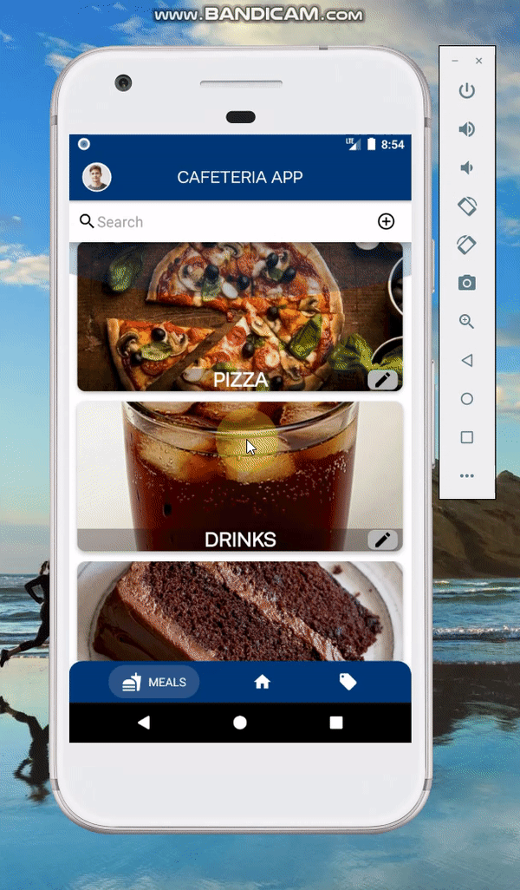
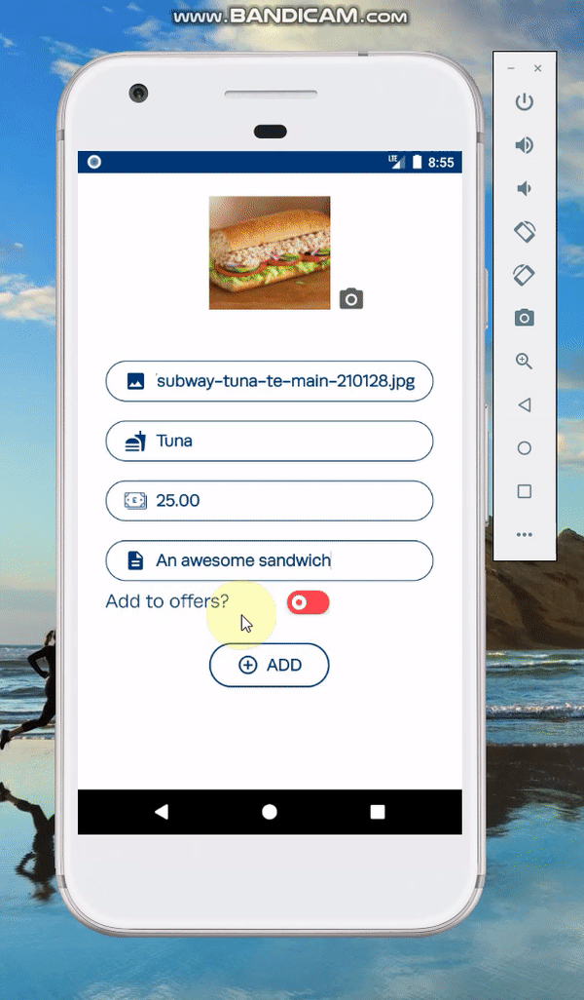
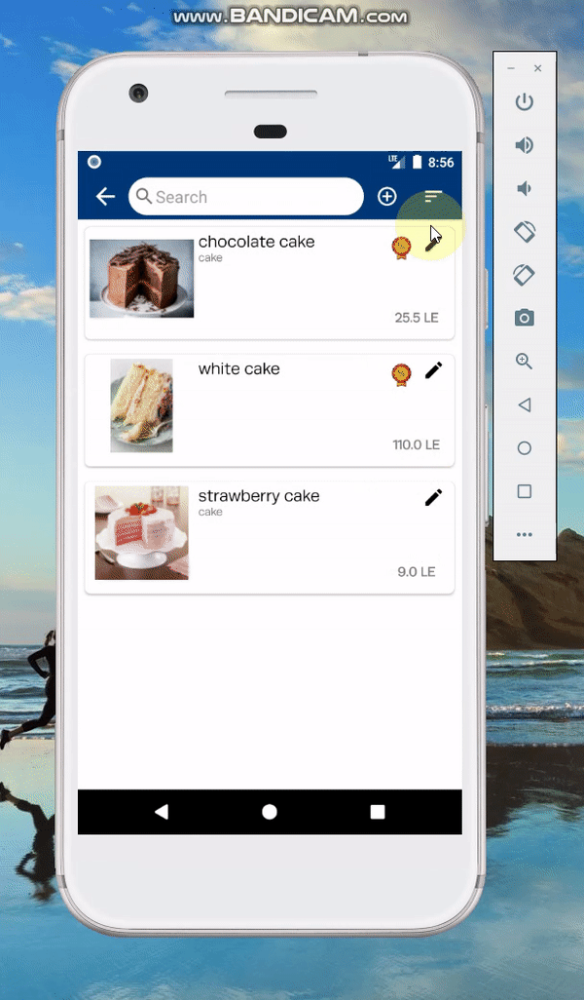

<h1 align="center">EVA Cafeteria Manager App</h1>

    

1- Manager can login and receive orders, after finishing orders can confirm order is ready:

2- Can search/add/update/delete for categories:

3- Also for products, manager can search/add/update/delete products:

4- Manager can sort products by cost (low-to-high) or (high-to-low):

5- Also can make offer on any product:

